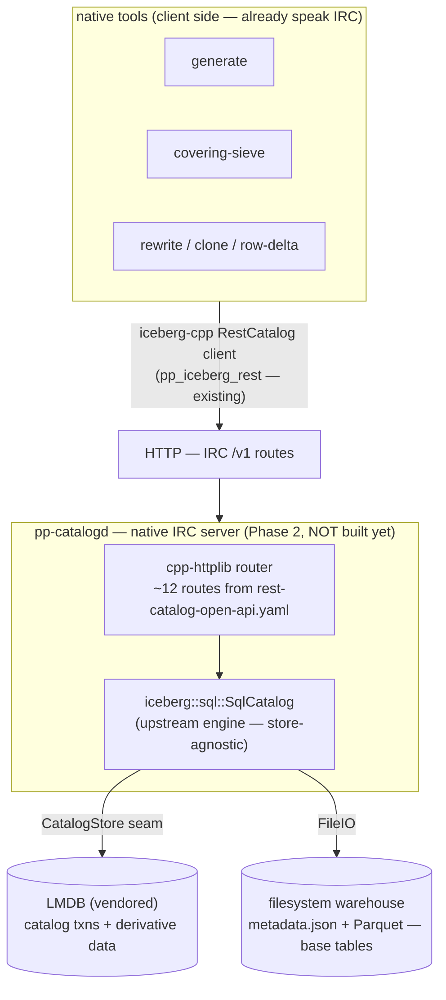
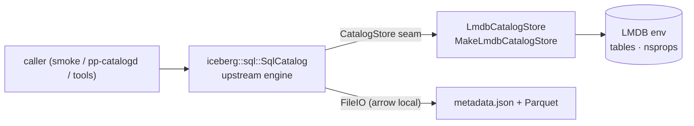
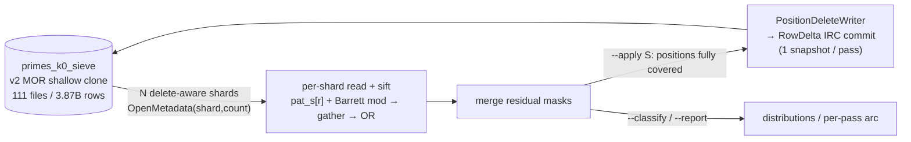
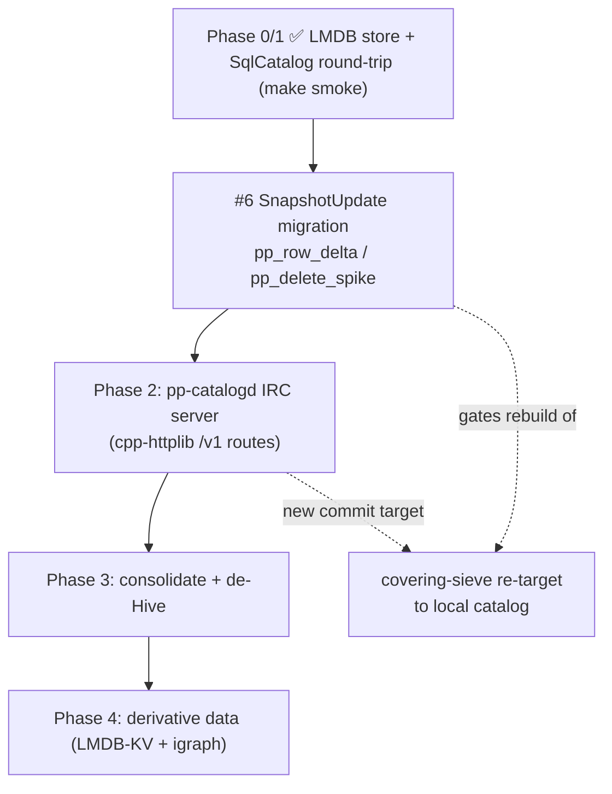
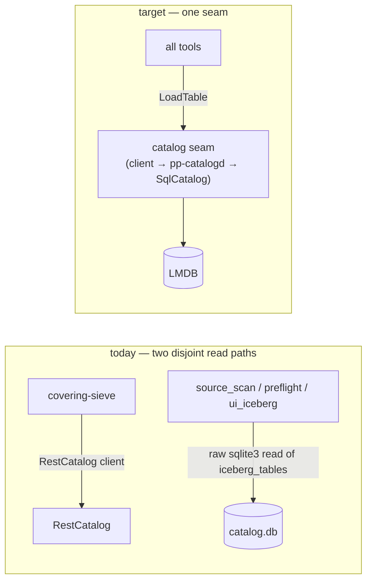

# Project Handoff: Prime Power Partition Obstruction Analysis

**Branch:** `pure-local` · **Date:** 2026-06-08
**Big shift on this branch:** Hive / MR3 / Kubernetes and the Python layer are
being **removed**. The query/MV engine moves to native C++ + **igraph**; the
catalog of record moves to a **native local Iceberg REST Catalog (IRC) backed by
LMDB**. This document is comprehensive and self-contained — it intentionally
duplicates material from `markdown/data_eng/irc_catalog_design.md`, the
`delete_primitive_spike.md` spike doc, `native/vendor/PATCHES.md`, and the agent
memory files so it can be read alone.

---

## 1. Overall Objective

This is an open-ended research project. The main object of study is the solutions
to the Diophantine equation:

For a given prime $p \in \mathbb{P}$, consider all solutions to
$$p = 2^m + q^n, \qquad m, n \ge 1,\ q \in \mathbb{P}.$$

Define $k$ as the number of such solutions for a given $p$. This branch is
concerned chiefly with the case $k = 0$. The broader objective is to determine
the algebraic and geometric structure that classifies the full solution set,
along with effective bounds and the computational complexity of the question.
Results fold back into further investigation.

## 2. Current Objective

Classify the $k=0$ primes in the `primeparts.primes` dataset by their **minimal
covering systems** — explaining *why* $p = 2^m + q^n$ has no solution for those
primes.

---

## 3. Mathematical Context and Operative Concepts

### 3.1 Necessary background

- **Parity of partition summands.** The equation is a length-two partition of $p$
  into two prime powers. Since $p$ is an odd prime ($p=2$ is trivial), one summand
  is even and the other odd — so one term always has base $2$.
- **Bit-length framing.** Summing a power of two with another prime power lets us
  treat the question as masking bits of $p$; bit lengths bound the size of $q^n$
  quickly.
- **Mersenne and primitive factors.** Mersenne numbers $M_n = 2^n - 1$ (more
  general than Mersenne primes). A prime factor $s \mid M_n$ is **primitive** if
  it divides no $M_k$ for $k < n$; otherwise it is **intrinsic**. Every odd prime
  $q$ divides some $M_d$ with $d = \mathrm{ord}_q(2)$.
- **Mersenne factors obstruct solutions.** For $k>2$ there exist
  $m,m',n,n',q,q'$ with $p = 2^m + q^n = 2^{m'} + q'^{n'}$. WLOG $m' < m$:
  $p - 2^{m'} = 2^{m'}(2^{m-m'} - 1) + q^n = q'^{n'}$. For $k=0$, if $p - 2^m = c$
  is composite for all $m$, ask which $m'$ give $p - 2^{m'} = b$ with
  $\gcd(b,c) > 1$. Since $c - b = 2^{m'}(2^{m-m'} - 1)$, the shared odd prime
  factors of $b$ and $c$ are factors of a Mersenne number.

### 3.2 Concepts utilized for the $k=0$ analysis

- **Propagation sifting.** If a sieve prime $s$ divides $p - 2^r$, it also divides
  $p - 2^{r + j\cdot d}$ where $d = \mathrm{ord}_s(2)$.
- **Covering systems.** A prime $p$ is obstructed if the arithmetic progressions
  for a set of primes $S$ cover every $m \in [1, \log_2 p]$.
- **Subgroup exclusion.** Even if only $s=3$ covers a position $m$, it may be
  blocked if $(p - 2^m) \bmod \ell$ falls outside the subgroup
  $\langle 3 \rangle \subset (\mathbb{Z}/\ell\mathbb{Z})^*$.
- **The covering identity (load-bearing).** $r_a - r_b = -2^b \cdot M_{a-b}$, so
  the moduli that can cover a position-gap $d$ are exactly the factors of $M_d$.
  This is why useful moduli are the small-order primitive Mersenne factors.

### 3.3 Stop criterion and definitions (resolved)

- **Minimal = irredundant.** A covering system is minimal when *every* residue
  class is required; drop any one and coverage breaks. This is the stop
  criterion — not a fuzzy "fewest moduli."
- **Moduli are odd primes.** The covering moduli $s$ are odd primes (3, 5, 7,
  11, …), never 2 — propagation sifting steps by $d = \mathrm{ord}_s(2)$, which
  needs 2 invertible mod $s$.
- **The first hole.** The uncovered remainder is the anti-join against
  `primes_k0`; its $\min(p)$ is the *first hole* — the smallest $k=0$ prime the
  current covering fails to explain. Under position-delete MOR the live
  (post-delete) rows *are* the uncovered set, so the first hole is just
  $\min(p)$ of the live table. **In practice the first hole is a weak progress
  signal** (it freezes for long stretches); the **open-position count** is the
  real metric.

---

## 4. Dataset basics (verified 2026-05-27)

- `primeparts.primes`: $\max(p) = 564{,}575{,}405{,}239 \approx 5.6\times10^{11}$;
  $\mathrm{count} = 21{,}698{,}850{,}257 \approx 21.7\text{ B}$ rows;
  $\min(p) = 3$ (p=2 absent). No primes skipped between 3 and $\max(p)$.
- `primeparts.partitions`: ~40 B rows. ~99.9 % are $n=1$ edges. These are the
  solutions for all primes in `primeparts.primes` (non-solutions omitted).
  **Caveat:** "almost always 1" refers to $n_k$, **not** $q_k$ multiplicity — at
  large magnitudes $q$ values repeat (~1.8×); the distinct-$q_k$ count is its own
  harder problem.
- `primeparts.primes_k0`: 3.87 B obstructed ($k=0$) primes; flat/unpartitioned,
  Iceberg format-version 2, merge-on-read, 111 data files. This is the sieve's
  fixed source.

---

## 5. The Pivot — Hive → igraph + native local LMDB IRC catalog

Hive (and its HMS-backed REST servlet at `192.168.1.202:9090`) was doing double
duty: the **catalog of record** *and* the **query/MV engine**. Both jobs are
being re-homed:

- **Query / MV / fast reads → native C++ + igraph** (implicit graphs for
  number-theoretic reads; purely local, research-oriented).
- **Catalog of record → native local IRC backed by LMDB** (this document's
  primary new system).

The earlier catalog of record was a **pyiceberg `SqlCatalog`** (SQLite,
JdbcCatalog schema) mirrored to HMS for the Hive engine. Removing Hive removes
the mirror; removing Python removes that catalog. We need a **native** local
catalog — and we want the **documented IRC standard** so any IRC client
(pyiceberg / Spark / Trino) could also point at it later.

### 5.1 Runtime architecture (target)



**Decision: IRC-forward.** The IRC contract is the spine. The iceberg-cpp
`RestCatalog` *client* integration stays; we add a native IRC *server*
(`pp-catalogd`, Phase 2) that delegates to upstream `iceberg::sql::SqlCatalog`,
backed by a vendored **LMDB** `CatalogStore`. Tools reach LMDB **only** through
the server. The metadata engine (apply `TableUpdate`s, write `metadata.json`,
optimistic-concurrency commit) lives in `SqlCatalog`, not the HTTP layer — so the
server is a thin JSON↔Catalog adapter.

**LMDB scope:** LMDB holds **only** the IRC catalog transactions
(`CatalogStore` rows + optimistic CAS) and **derivative data** (MV-like read
indexes — a separate igraph track). Base Iceberg tables (`primes`, `partitions`,
`primes_k0`, …) stay as Parquet + `metadata.json` on the filesystem, read/written
through iceberg-cpp FileIO. **No base data is copied into LMDB.**

nginx/Lua were considered for the edge and **bracketed**: there is no Iceberg
metadata library outside C++ here, so the engine must stay in iceberg-cpp; a
reverse proxy can front the server later if it goes remote.

---

## 6. Native local catalog — DONE + VERIFIED (Phase 0/1)

### 6.1 Catalog engine — upstream `iceberg::sql::SqlCatalog`

Merged from `origin/main` into the vendored tree
(`native/vendor/iceberg-cpp/src/iceberg/catalog/sql/`). It implements the full
`Catalog` API (create / commit / load / register / rename / drop, namespaces,
optimistic CAS) over a driver-agnostic `CatalogStore` interface
(`catalog_store.h`) — "no SQL strings or driver-specific types." Schema is
JdbcCatalog-compatible (`iceberg_tables`, `iceberg_namespace_properties`).

We do **not** use the built-in SQLite/Postgres/MySQL connectors (those need
sqlpp23). Built with `-DICEBERG_BUILD_SQL_CATALOG=ON` and **no** connector:
`resolve_sql_catalog_dependencies()` returns cleanly ("no built-in connectors
enabled"), so `iceberg_sql_catalog` builds from `sql_catalog.cc` +
`connection_uri.cc` with **zero sqlpp23 dependency**. We inject our own store via
`SqlCatalog::Make(config, file_io, store)`.

Key `CatalogStore` contract points the store must honor (from `catalog_store.h`
and the upstream SQLite reference `catalog_store_sqlpp23_internal.h`):
- **Unique violations** on `InsertTable` / `InsertNamespaceProperty` /
  `RenameTable` → `ErrorKind::kAlreadyExists` (the catalog's authoritative signal
  for concurrent creates).
- **`UpdateTableMetadataLocation(expected)`** is the optimistic CAS — returns the
  number of rows updated (1 on success, **0 on a stale base**).
- **`RunInTransaction(body)`** commits on `body` success, rolls back otherwise;
  nested store calls issued inside `body` reuse the same transaction.
- **Namespace existence** is derived: a namespace exists iff it has ≥1 property
  row **or** owns ≥1 table. `SqlCatalog::CreateNamespace` inserts a sentinel
  property `exists="true"` so empty namespaces still exist;
  `GetNamespaceProperties` filters that sentinel out itself.

### 6.2 LMDB `CatalogStore` — `native/src/catalog/pp_lmdb_store.{h,cc}`

`LmdbCatalogStore : iceberg::sql::CatalogStore` over vendored `liblmdb`. Factory:

```cpp
iceberg::Result<std::shared_ptr<iceberg::sql::CatalogStore>>
MakeLmdbCatalogStore(std::filesystem::path path, std::string catalog_name,
                     std::size_t map_size_bytes = (std::size_t{512} << 20));
```



**Sub-DB layout** (one env per catalog, **two** named DBIs — no separate
namespaces table, matching the SQL store, which likewise derives namespaces by
unioning the properties table with the distinct table namespaces):

- `tables`  : key = `ns '\0' name` → value = `metadata_loc '\0' previous_loc`
- `nsprops` : key = `ns '\0' propkey` → value = `<presence-byte> [value bytes]`
  (the presence byte distinguishes a SQL-NULL property value from an empty
  string).

`metadata_location` / names are file paths / identifiers and never contain a NUL,
so `'\0'` is an unambiguous field separator.

**Method → LMDB realization:**

| CatalogStore method | LMDB realization |
|---|---|
| `Initialize()` | mkdir + open env, open two named sub-DBs (`tables`, `nsprops`) |
| `ListNamespaceNames()` | cursor scan **both** DBs, union distinct `ns` (key prefix before `\0`) |
| `GetNamespaceProperties(ns)` | cursor range-scan `nsprops` prefix `ns\0` |
| `InsertNamespaceProperty` | `mdb_put` `MDB_NOOVERWRITE` (`KEYEXIST`→`kAlreadyExists`) |
| `DeleteNamespaceProperty` / `DeleteNamespace` | `mdb_del` / prefix scan + del, return count |
| `ListTableNames(ns)` | cursor range-scan `tables` prefix `ns\0` |
| `TableExists` / `GetTableMetadataLocation` | `mdb_get` on `tables` (first field = metadata_loc) |
| `InsertTable` | `mdb_put` `MDB_NOOVERWRITE` (`KEYEXIST`→`kAlreadyExists`) |
| `UpdateTableMetadataLocation(expected)` | **CAS**: get → compare first field to `expected` → put; return 1/0 |
| `DeleteTable` | `mdb_del`, return count |
| `RenameTable` | get `from` → put `to` `MDB_NOOVERWRITE` → del `from` |
| `RunInTransaction(body)` | `mdb_txn_begin` (write) → stash in `active_txn_` → run body → commit/abort |

**Concurrency model.** Every op runs under one `std::recursive_mutex`, and each
LMDB transaction begins+ends within a single mutex-held critical section on one
thread — trivially satisfying LMDB's single-writer rule and its per-thread
transaction binding **without `MDB_NOTLS`**. The active write txn is stashed in
`active_txn_` so nested store calls (issued by `SqlCatalog` inside
`RunInTransaction`) reuse it rather than self-committing; standalone calls open
their own short txn and commit on success / abort on error. LMDB's
single-writer / multi-reader MVCC + mmap = low RSS, zero-copy reads. Read
concurrency is intentionally sacrificed for simplicity (catalog read volume is
negligible).

**Tradeoff.** LMDB drops SQL-DB-level catalog interop (a JdbcCatalog client can't
open an LMDB file). We keep IRC interop (via the Phase-2 server) and standard
on-disk `metadata.json`. The `CatalogStore` seam keeps SQLite available later
(config swap) if interop is ever wanted — no need to build both now.

### 6.3 Build & link

- **Vendored deps** (`native/vendor` is gitignored; provision-by-clone, keep
  `.git`): LMDB at `native/vendor/lmdb` (mirror `lmdb/lmdb`, branch
  `mdb.master3`, v0.9.90); sources `libraries/liblmdb/{mdb.c,midl.c,lmdb.h}`.
- **`liblmdb.a`** is built from `mdb.c` + `midl.c` (Makefile `$(LMDB_LIB)`,
  `LMDB_CFLAGS = -O3 -g -fPIC -pthread`, `LMDB_CPPFLAGS = -I$(LMDB_DIR)`).
- **Installed iceberg libs** at `/usr/local/lib` are **static `.a`** (rebuilt
  2026-06-08, static, `BUNDLE=ON REST=ON SQL_CATALOG=ON`). Mixing static / shared
  / prebuilt → double-free at exit; keep everything static from one build.
- **Link gotchas (static, both real failure modes hit):**
  1. `-liceberg_sql_catalog` (`SQL_CATALOG_LDLIBS`) must come **before** the
     iceberg core archives (`ICEBERG_LDLIBS`) so its references resolve in static
     link order.
  2. Do **not** append a trailing `-lparquet -larrow` after `ICEBERG_LDLIBS` —
     the static `.a` are already inside it, and the bare `-l` pulls the missing
     shared `libarrow.so.2500` at runtime ("cannot open shared object").

### 6.4 Verification — `make smoke` (0 failures)

`native/src/catalog/pp_lmdb_smoke.cc` → `primeparts-lmdb-smoke`. Two parts:

- **Part A — store contract** (no FileIO; the authoritative persistence test):
  unique-violation → `kAlreadyExists` (insert table/nsprop, rename-onto-existing);
  optimistic **CAS** (`UpdateTableMetadataLocation` fresh-base → 1, stale-base →
  0); rename moves row+value and frees the old key; `RunInTransaction` **commit
  and rollback**; `ListNamespaceNames` unions nsprops-namespaces with table-only
  namespaces; `DeleteNamespace` returns the row count.
- **Part B — engine integration:** `SqlCatalog::Make(cfg, LocalIO(), lmdb_store)`
  then CreateNamespace → CreateTable (writes `metadata.json`, commits the pointer
  through LMDB) → LoadTable → RenameTable → DropTable → DropNamespace. (Gotcha:
  the arrow local FileIO does **not** mkdir parents — pre-create
  `<loc>/metadata/`.)

Run it: `cd native && make smoke`.

---

## 7. Position-delete / RowDelta primitive — GREEN

The covering-sieve persists progress as **merge-on-read (MOR) position deletes**,
so this primitive underpins it. Verified end-to-end 2026-05-31 (`pp-catalog
--delete-spike`): native `PositionDeleteWriter` → `RowDelta` IRC commit →
delete-aware read-back (5 → delete 2 → 3). `_pos` projection correct,
~38 ms/commit.

- **`RowDelta` lives in-tree:** `native/src/catalog/pp_row_delta.{h,cc}` — a
  committable position-delete `SnapshotUpdate` subclass; commits via the generic
  `PendingUpdate::Commit` (no library change, no `Transaction` accessor needed).
- The `snapshot_update.cc` `data_sequence_number` FIXME does **not** bite us: we
  only delete from a *fixed* `primes_k0` clone, so deletes always post-date the
  data.
- Puffin deletion-vector blobs are out of scope; position-delete *files* (MOR v2)
  are the on-ramp.
- Full writeup: `markdown/data_eng/delete_primitive_spike.md` (incl. the
  "Vendored rebuild recipe").

---

## 8. Covering-sieve filter — BUILT & VALIDATED (2026-06-01)

`native/src/covering_sieve_main.cc` → `primeparts-covering-sieve`. **Validated at
scale on the real 3.87 B-row `primes_k0`.** Note `sieve_triage_main.cc`'s triage
folds into this stepper; that standalone main goes away once the stepper owns the
triage.

### 8.1 Conceptual frame (load-bearing)

This is a **FILTER, not a sieve.** Covering = a *local* (mod-$\ell$ /
Mersenne-factor) explanation of obstruction. The **object of study is the
SURVIVOR set** after applying Mersenne-factor coverings — primes whose
obstruction no covering reaches = **local→global breakdowns**. Drop
$\min(p)$/first-hole as the goal; track the open-position count.

### 8.2 The kernel — vectorized + multithreaded



- **Vectorized sift:** per-modulus pattern table `pat_s[r]` (`BuildCov`) + Barrett
  `FastMod`; hot loop is `mod → gather → OR` (`SiftBatch`), **no scalar
  phase-search**. (The scalar `GetCoverageMask` in `primitive_factors.cc` only
  *builds* the tables.)
- **Multithreaded read:** $N$ independent **delete-aware shard** readers.
  `SourceTableReader::OpenMetadata` gained `(shard_index, shard_count)` params
  (default `0,1` = all, backward-compatible) that filter planned `FileScanTask`s
  by `i % shard_count` after the p-sort. Each shard streams + sifts its ~1/N
  files in parallel; merge after join. Arrow CPU+IO pools sized to shard count.
- **Result:** `--apply 3` then `--apply 5` → **6.0 s/pass, 645 Mrow/s, ~1709 %
  CPU** (vs 64 s / 106 % for the old serial producer that wrongly drove a bulk
  read through `SourceTableReader::Next()`'s serial cursor).

### 8.3 Persistence

Position-delete MOR over **`primeparts.primes_k0_sieve`**, a metadata-only
**shallow clone** of `primes_k0` (`pp-catalog --clone-sieve`,
`src/catalog/pp_sieve_clone.{h,cc}`: native IRC CreateTable + FastAppend of
`primes_k0`'s 111 existing DataFiles, **zero row-copy**; dest is v2, 111 files,
3.87 B rows). The live (post-delete) rows **are** the current uncovered set; a
pass *is* a snapshot. Each pass stamps `covering.*` (incl. `ord`,
`open_positions`) into its snapshot summary — **the snapshots ARE the
sieve_passes log** (no separate table); `--report` dumps the whole arc.

> **CAVEAT:** `primes_k0_sieve` shares `primes_k0`'s data files — do **not**
> REBUILD or orphan-clean `primes_k0` during a campaign. Reset a campaign with
> `pp-catalog --clone-sieve`.

### 8.4 Triage (choose the next modulus) — `--metric {expected|bestclass|hybrid}`

The scan tallies `{residual bitmask → count}` (cheap; no per-prime candidate
loop), then post-scan scores each Mersenne **order** $d$ by best-class
elimination $\sum_R \mathrm{count}(R)\cdot \max_c \mathrm{popcount}(R\ \&\ \{m\equiv c \bmod d\})$;
candidates are the primitive Mersenne factors straight from `helper.ord2_by_q`
(not tested per prime). **INVARIANT: one modulus per pass (1:1 snapshot)** —
load-bearing, do not batch.

3-way comparison verdict (8-stage greedy campaigns from `{3}`, cumulative
deletions @ stage 8):
- **`expected`** (1/(q-1), structure-blind ≈ "apply smallest unused odd prime"):
  **15.69 M** — cleanest, matches the lab-notes backbone {3,5,7,11,13,17,…}.
  **Now the default.**
- `hybrid` (best-class × d/(q-1)): 14.40 M — deferred the valuable modulus 7.
- `bestclass` (max_c only): 6.75 M — chased large-q artifacts. Worst.

VERDICT: the naive realized metric wins; the "structure-aware" sophistication
hurt.

### 8.5 Key findings

- **Greedy depletion is CONCAVE / diminishing returns.** 40-stage ascending
  campaign {3,5,7,…,673}: per-pass deletions rise → peak ~9.12 M (stage 13) →
  ~8 M plateau → decline to 1.40 M (stage 40). Cumulative 201 M deleted (5.2 % of
  3.87 B), decelerating; open positions 71.7 B → 12.0 B (83 %). **Greedy-ascending
  asymptotes — proves the mechanism but cannot reach the local→global residue
  greedily** (would take thousands of moduli, may never finish).
- **`--classify`** (read-only, ~6.5 s / 595 Mrow/s over full `primes_k0`): for the
  fixed backbone {3,5,7,11,13,17}, counts residual gaps per prime. **Only 0.13 %
  (5,185,251) are fully backbone-covered**; mass at 5–7 gaps (mode 6). This
  **cross-validates** the campaign exactly: 0-gaps = cumulative deletions after
  {3,5,7,11,13,17}, off by exactly 1 = $p=3$ (the campaign has the $r=1$ fix,
  `ClassifyBatch` doesn't). Two independent paths agree.
- **The $r=1$ trivial obstruction** (only $p=3$) is handled, which unsticks the
  first hole (149 → climbs); first hole is now a **diagnostic only**.

### 8.6 Algorithm fact (non-obvious, load-bearing)

**No single modulus fully covers any prime with `max_m ≥ 2`** — coverage is
strictly incremental: early passes delete nothing, yet **every modulus must still
be committed/recorded as applied**. Worked example: `{3,7}` together cover all
positions of $p=11$ (3 covers {1,3}, 7 covers {2}); $p=11$ is deleted on the pass
that adds 7 after 3. Bit convention: bit `m-1` = position $m$; initial uncovered
mask `(1<<max_m)-1`, `max_m = FloorLog2(p)`.

### 8.7 Sieve research — next directions (research, not build gaps)

1. Per-gap-position analysis: for the open positions, is $p - 2^m$ coverable by
   **any** small-order modulus, or genuinely uncoverable (the real residue)?
2. Residue-tuple (92,160 groups, mod 255255) keying to find the lab-notes' ~22
   unconditional 100 %-obstruction classes.
3. `--classify` against the **full** small-order Mersenne-factor set with an order
   sweep to size the genuine residue; optionally add the $r=1$ fix to
   `ClassifyBatch`; interactive stdin loop + tie-break (ratio ≥ 4).

Full sieve state: agent memory `project_sieve_build_state`.

> **Re-target note:** the sieve's persistence and clone ran against the **HMS REST
> servlet** (`192.168.1.202:9090`) with native IRC commits. With Hive removed,
> these re-target the **new local LMDB catalog** once Phase 2/3 land — see §10.

---

## 9. Vendored iceberg-cpp local patches (`native/vendor/PATCHES.md`)

`native/vendor/iceberg-cpp` tracks Apache iceberg-cpp; we carry **4 local
patches** that a naive re-vendor / `git checkout` / clean pull **silently
destroys**. Re-apply from `PATCHES.md` and rebuild+reinstall the static libs.

1. **`CMakeLists.txt` — honor `-DCMAKE_COMPILE_WARNING_AS_ERROR`.** Upstream
   hard-`set()`s it ON, shadowing `-D` overrides; guarded so a user `-D` wins
   (GCC trips a `-Werror=free-nonheap-object` false positive in `json_serde.cc`
   otherwise).
2. **`table_metadata.cc` — partition field-id base (Hive compat).**
   `FreshPartitionSpec` starts `last_partition_field_id` at
   `kLegacyPartitionDataIdStart - 1` (1000-convention) instead of
   `kInvalidPartitionFieldId`, so partition IDs don't collide with reserved
   manifest_entry IDs.
3. **`arrow/arrow_io.cc` — accept `file:/` single-slash URIs.**
   `ArrowFileSystemFileIO::ResolvePath` only stripped a scheme on `"://"`, so
   Hive/Hadoop single-slash `file:/media/...` manifest paths broke arrow's
   `LocalFileSystem`. **Without this, native iceberg-cpp cannot scan ANY
   Hive-created table** (incl. the `primes_k0` MV the sieve consumes). Re-apply if
   re-vendored. (Memory: `project_icebergcpp_hive_uri_patch`.)
4. **`json_serde.cc` — `assert-ref-snapshot-id` requirement field is `ref`, not
   `ref-name`.** The REST spec uses `ref` for the `AssertRefSnapshotId`
   *requirement* but `ref-name` for the snapshot-ref *updates*; iceberg-cpp
   collapsed both onto one `kRefName`. Added a distinct `kRef = "ref"` used **only**
   in the requirement serde. **This gates ALL snapshot-advancing native IRC
   commits** (FastAppend, RowDelta) — without it, commits fail with
   `IllegalArgumentException: Cannot parse missing string: ref`. PR drafted at
   `iceberg-refs/upstream-pr-ref-field.md`; retires if merged. The cached
   spec/tracker lives at `native/vendor/iceberg-refs/` (`refresh.sh`).

The merge that brought in SqlCatalog (#273) also brought a **#689 Hive-catalog
skeleton** (option + `src/iceberg/catalog/hive/` export header only, no working
sources) — a marker for a possible future native HiveCatalog (Thrift→HMS,
blueprinted on iceberg-rust's `iceberg-catalog-hms`), **not usable yet**.

---

## 10. Remaining work / roadmap



1. **Task #6 — migrate `pp_row_delta.cc` / `pp_delete_spike` to the new
   SnapshotUpdate API.** The 2026-06-08 rebuild changed the ABI:
   `CleanUncommitted` return type `void`→`Status`, new virtual
   `SetSummaryProperty`, `WriteDeleteManifests` now takes
   `std::span<const ContentFileWithSequenceNumber>`; `fast_append.h` mirrors the
   `Status` change. **Nuance:** `covering_sieve_main.cc` depends on
   `pp_row_delta`, so the validated sieve binary **won't recompile against the
   rebuilt lib until #6 lands.** This is what currently blocks a full `make all`.
2. **Phase 2 — `pp-catalogd`.** cpp-httplib IRC routes over
   `SqlCatalog(LmdbStore)`; server-side JSON shapes (~12 core table/namespace
   routes from `native/vendor/iceberg-refs/rest-catalog-open-api.yaml`).
   Acceptance = iceberg-cpp `RestCatalog` client round-trip (createTable + commit
   e2e against `pp-catalogd`); `curl GET /v1/config` first. **This JSON
   shape-matching is the real work.**
3. **Phase 3 — consolidate + de-Hive** (the source reorg; **full detail in §11**).
   First chunk: reconcile the Makefile with the new subdir tree so `make all`
   builds again (§11.3). Then excise Hive (`pp_hive_sync`, `pp-catalog`
   `--hive-*` / `--smoke-test`, `scripts/hive_register.sh`, `scripts/hive_sql.py`,
   `mr3/kubernetes/`); **re-point the three raw-`sqlite3_open` readers**
   (`source_scan.cc`, `rewriter/preflight.cc`, `ui_iceberg.cc`) onto the catalog
   seam (§11.4) — they strand when the catalog moves off SQLite; hoist shared
   boilerplate into `iceberg_util.h`; fold `sieve_triage` into the stepper.
   **Must land with the catalog cutover or the scan/TUI tools break.**
4. **Phase 4 — derivative data (separate track).** LMDB-backed derived indexes +
   **igraph** implicit-graph read paths for fast number-theoretic reads (the MV
   replacement). Sketch only so far.

**Open question to resolve during Phase 2/3 (not yet decided):** the sieve's
position-delete MOR commits and `--clone-sieve` ran against the HMS REST servlet;
they must re-target the local LMDB catalog. Confirm the local IRC server honors
native CreateTable + FastAppend + RowDelta the same way the HMS servlet did.

---

## 11. Source-tree reorganization (IN PROGRESS — read before `make all`)

Commit `9e6d8ad` ("Started the reorganization of files with ./native/src path")
began moving the flat `native/src/*.cc` layout into purpose subdirectories **and
removed the one-time staging binaries.** This is mid-flight: the **Makefile still
references the old flat paths**, so a plain `make all` is currently **broken** for
the moved/removed targets. Only the catalog/LMDB targets build today — including
`make smoke`, which is why Phase 0/1 verified cleanly while the rest of the tree
did not. Reconciling the Makefile (and finishing the consolidation below) is the
first concrete chunk of Phase 3.

### 11.1 Current on-disk layout

```
native/src/
  core.c  generate.cc  writer.cc  source_scan.cc  ui_iceberg.cc
  mersenne_sidecar.cc  bench.c  materialize_bench.c  tui_frontend.c   # root — not yet sorted
  catalog/     pp_lmdb_store  pp_lmdb_smoke  pp_iceberg_rest  pp_row_delta
               pp_sieve_clone  pp_delete_spike  pp_catalog_main  pp_hive_sync  README.md
  coverings/   covering_sieve_main  primitive_factors  primitive_factors_main  sieve_triage_main
  rewriter/    rewrite  preflight
  fix.patch    # stray — investigate / remove
```

Headers were **not** moved — `include/primeparts/*.h` is still flat (incl.
`preflight.h`, `primitive_factors.h`, which now live apart from their sources).

### 11.2 Removed in `9e6d8ad` (one-time staging binaries; git history only)

- `backfill_prime_rank_main.cc` — in-place `prime_rank` backfill template.
- `drop_bucket_cols_main.cc` — one-shot bucket-col stripper (already ran across the
  warehouse). Its `MakeDataFile` partition-value / `value_counts` pattern — the
  reference for omitting identity-partition source columns from a committed
  `DataFile` — now survives only in git history; preserve it if any future tool
  writes data files.

### 11.3 Makefile reconciliation (blocking `make all`)

The object rules still point at pre-move paths:

| Makefile reference | now at | action |
|---|---|---|
| `src/covering_sieve_main.cc` | `src/coverings/covering_sieve_main.cc` | repath |
| `src/sieve_triage_main.cc` | `src/coverings/sieve_triage_main.cc` | repath, or drop (folds into the stepper) |
| `src/primitive_factors.cc`, `src/primitive_factors_main.cc` | `src/coverings/…` | repath |
| `src/rewrite.cc` | `src/rewriter/rewrite.cc` | repath |
| `src/preflight.cc` | `src/rewriter/preflight.cc` | repath |
| `src/backfill_prime_rank_main.cc` | (removed) | drop target `primeparts-backfill-rank` |
| `src/drop_bucket_cols_main.cc` | (removed) | drop target `primeparts-drop-bucket-cols` |

The `src/catalog/…` rules (and the new LMDB rules) are already correct. A
`vpath %.cc src src/catalog src/coverings src/rewriter` plus dropping the two
removed targets is the low-churn fix.

### 11.4 DRY consolidation plan (from the source explorations)

**Catalog module — remove / keep / refactor:**
- **Remove:** `pp_hive_sync.{h,cc}` (100 % Hive); `pp_catalog_main`'s
  `--smoke-test` / `--hive-exec` / `--hive-sync`; `pp_delete_spike`'s
  beeline-driven `RunDeleteSpike`.
- **Refactor:** `pp_iceberg_rest` — add a `MakeLocalCatalog` factory that builds
  `SqlCatalog(LmdbStore)` (for in-process use / the server's engine), drop Hive
  comments; swap `RunMorVerify`'s `HiveExec` create/drop for native
  `CreateTable`/`DropTable`.
- **Keep:** `pp_row_delta` (pure iceberg-cpp); `pp_sieve_clone` (drop the Hive
  fallback messaging).
- Minimal `Catalog` surface the codebase actually uses: `NamespaceExists`,
  `CreateNamespace`, `LoadTable`, `CreateTable`, `DropTable`, `RegisterTable`, plus
  the commit path (`NewFastAppend` / `RowDelta`).

**The raw-SQLite reader coupling (key — breaks on cutover).** Three readers open
`iceberg_tables` **directly via `sqlite3_open`** (identical lookup + `file:` strip
+ int64 decode, triplicated), bypassing the catalog API:
`src/source_scan.cc`, `src/rewriter/preflight.cc`, `src/ui_iceberg.cc`. Moving the
catalog to LMDB **strands all three** unless they resolve metadata through the
catalog seam. Consolidate the duplicated bits into
`include/primeparts/iceberg_util.h` **and** re-point metadata resolution onto the
catalog (`LoadTable`), not raw SQLite.



**Other DRY hotspots (shared headers).** Arrow thread-pool setup (≈4 mains),
`MakeCatalog` + `RestOptions` boilerplate (≈2), and progress bar / monitor (≈2–3)
are candidates for shared headers. Confirm the Arrow `RegisterAll` once-guard is
present and consistent across every entry point that opens Iceberg I/O
(`pp_iceberg_rest`, `source_scan`, `ui_iceberg`, `rewriter/{preflight,rewrite}`
each reference it — verify none double-register). `source_scan` and `writer` are
already clean seams. Fold `sieve_triage` into `covering_sieve`.

## 12. Native tooling inventory

- `native/src/coverings/covering_sieve_main.cc` → `primeparts-covering-sieve`: the
  covering FILTER / interactive stepper (§8). `--apply S`, `--metric`, `--report`,
  `--classify`, `--clone-sieve` (via pp-catalog).
- `native/src/coverings/sieve_triage_main.cc` → `primeparts-sieve-triage`:
  standalone bitmask-distribution triage; **folds into the stepper**, removed once
  it owns triage.
- `native/src/coverings/primitive_factors.cc` (+ `primitive_factors_main.cc`):
  `GetCoverageMask` / `MersenneHelper` (`ord2_by_q`); scalar table-builder only.
- `native/src/writer.cc`: Iceberg-aware Parquet writer; skips identity-partition
  source fields (`p_bucket_version`, `p_bucket`) from the physical schema. The
  `BucketParquetWriter` "refuse to overwrite" check needs care in MT runs.
- `native/src/source_scan.cc`: delete-aware streaming reader; `OpenMetadata`
  with `(shard_index, shard_count)` sharding. **Reads `iceberg_tables` via raw
  `sqlite3_open` — Phase-3 re-point target.**
- `native/src/rewriter/{rewrite,preflight}.cc`: in-place stream-and-rewrite path;
  `preflight.cc` is one of the three raw-`sqlite3_open` readers (§11.4).
- `drop_bucket_cols_main.cc` / `backfill_prime_rank_main.cc`: **removed** in
  `9e6d8ad` (§11.2); git history only.
- `native/src/mersenne_sidecar.cc` → `mersenne-sidecar`: builds
  `mersenne_reference.parquet` (factorization + primitive factors of
  $M_m = 2^m-1$) for $\mathrm{ord}_s(2)$ lookup.
- `native/src/core.c`: heart of solution generation (see
  `markdown/math/modular-filter-idea.md`, `modular_filter_more_ideas.md`).
- `native/src/catalog/`:
  - `pp_lmdb_store.{h,cc}` (**new, §6.2**) + `pp_lmdb_smoke.cc` (`make smoke`).
  - `pp_iceberg_rest.{h,cc}`: IRC/RestCatalog client — `MakeCatalog`,
    `EnsureNamespace`, `PublishTable`, `LatestMetadataJson`, `LocalIO`. The
    IRC-mains consolidation is effectively done: `coverings/covering_sieve_main.cc`
    now `#include`s this lib, and the two mains that copied the logic
    (backfill, drop_bucket) were removed (§11.2). Phase-3 work left here is the
    `MakeLocalCatalog` factory + dropping the Hive comments (§11.4).
  - `pp_row_delta.{h,cc}` (**§7**): committable position-delete `SnapshotUpdate`.
  - `pp_sieve_clone.{h,cc}`: `--clone-sieve` shallow clone.
  - `pp_delete_spike.{h,cc}`, `pp_catalog_main.cc` → `pp-catalog`.
  - **Slated for removal (Phase 3):** `pp_hive_sync.{h,cc}` + the Hive
    subcommands.

### Where state lives (agent memory + docs)
- Design doc: `markdown/data_eng/irc_catalog_design.md` (the catalog system).
- Spike doc: `markdown/data_eng/delete_primitive_spike.md` (RowDelta + rebuild
  recipe).
- Memory: `project_vendored_iceberg_build_state`, `project_catalog_module`,
  `project_sieve_build_state`, `project_delete_primitive_green`,
  `project_icebergcpp_hive_uri_patch`.

---

## Appendix A — Superseded (Hive era), condensed

Kept for recoverability; **all of this is being removed.** The query/MV engine and
catalog-of-record both moved native (§5).

- **MV inventory (as of 2026-05-27).** Hive materialized views on the
  funbuns/primeparts warehouses, served via HS2 + MR3, sized as precomputed
  indexes for native consumers. Built: `primes_k0` (3.87 B; now a base table the
  sieve consumes), `q_k_freq_lo`, `q_k_freq_mid`, `q_k_histogram` (39-row
  magnitude index). Planned/never-finished: `partitions_n_ge_2`,
  `partitions_low_q`. Rejected: `q_k_freq_hi`/`q_k_freq_top` (full-cardinality
  form doesn't fit a 16 GiB single node → collapsed into `q_k_histogram`). Full
  table: `markdown/data_eng/MV_list.md`. **MV stub-zombie gotcha:** a failed
  `CREATE MATERIALIZED VIEW` leaves a registered stub — always prepend
  `DROP IF EXISTS` when retrying.
- **HMS sync (verified, now moot).** A native IRC / on-disk commit did **not** by
  itself make a snapshot-advancing change visible to the Hive engine; an HMS-side
  op had to set the table's `metadata_location`. Mechanism:
  `scripts/hive_register.sh sync` = `ALTER TABLE … SET
  TBLPROPERTIES('metadata_location'=…)` over remote beeline (routes through the
  same `HiveIcebergStorageHandler` the engine reads with — so the handler
  **re-commits** the target snapshot as a new `metadata.json`, it is **not** a raw
  pointer swap). Required **Java 21** (host default Java 25 breaks bundled jline
  FFM), `-Dorg.jline.terminal.provider=dumb`, and **HTTP transport on :10001**.
  Verified on throwaway `primeparts.zz_synctest` (3 → sync to empty → 0 → sync
  back → 3). The raw-Thrift `sync_hms.py` path was already dead.
- **Cluster (MR3/Kubernetes).** HS2 + MR3 + HMS-IRC in `mr3/kubernetes/`; config
  files (`hive-site.xml`, `mr3-site.xml`, `tez-site.xml`, the `{hive,metastore}`
  YAMLs, `env.sh`) were tuned 2026-05-27 to a one-worker × 8 GiB envelope. Local
  native/IRC runs scaled MR3 compute to 0 to reclaim ~10 GB (keeping only the
  metastore that hosts IRC :9090 + its mysql). Per-task memory floor: shrink
  `tez sort.mb` when shrinking `task.memory.mb`. A busybox init-container GC
  recurred (`hive_mr3_stack.md` §"Known gotchas" #9).
- **Cutover sweep.** `primeparts.primes_k0` was relocated to `/ib-staging/`
  (DROP + recreate, ~290 s, verified 3,874,747,523 rows); the old funbuns-path
  dir was left for the user to `rm -rf`. The discarded Pass-1 string-label
  artifact `obstruction_catalog` (comma-string `covering_system` labels like
  `3,5,7`) at `ib-staging` is **superseded, not re-swept** — that string-label
  partitioning *was* the naming bug the sieve rewrite fixed.

## Appendix B — Terminology

- Call the `(m_k, n_k, q_k)` tuples **"partitions"** in prose; the iceberg table
  name `decompositions` is a code identifier only.
- **`prime_rank`** = the prime-counting function $\pi(p)$ (library-agnostic);
  `rank_min` in boundaries is a **row-count**, not a $\pi$-value.
- **"Snap"** = physically re-sort on-disk data to match a declared `sort_order`;
  sort violations get fixed by re-snapping, not by relaxing the check.
