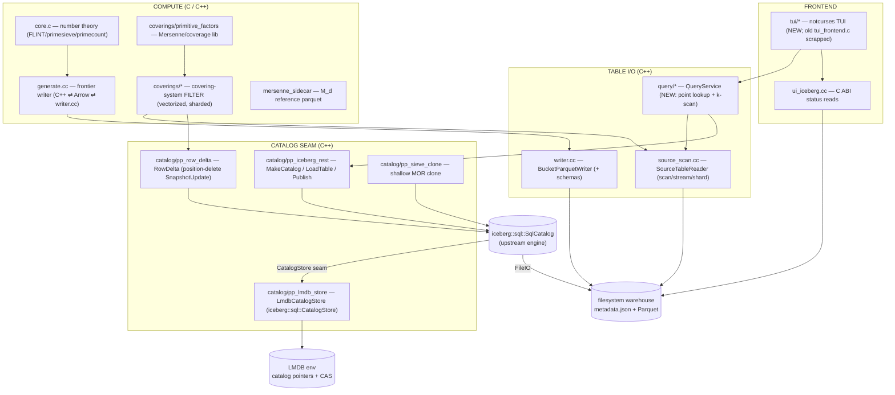
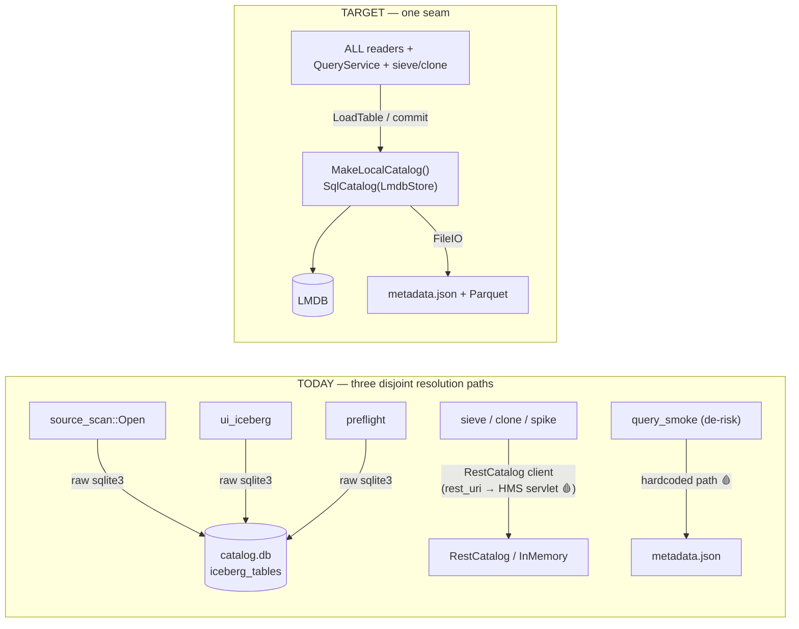

# primeparts `native/` — Architecture Map

**Status:** 2026-06-14. Synthesized from a full-tree sweep of `native/`. This is
the canonical map of the native subsystem as we pivot to **LMDB catalog seam
from the ground up** (HMS/Hive removed entirely, native query layer added).
Companion docs: `tui_query_design.md` (query layer, same dir),
`../data_eng/irc_catalog_design.md` (catalog), `../../HANDOFF.md` (narrative).

---

## 1. The shape of the system

**The pivot in one line:** everything that used to resolve tables via raw SQLite
(or a remote HMS REST servlet) re-homes onto a single seam —
`MakeLocalCatalog()` → `iceberg::sql::SqlCatalog(LmdbCatalogStore)` → `LoadTable`
— while base table data stays as Parquet + `metadata.json` on disk.

---

## 2. Module inventory (responsibility · build state)

Legend: ✅ builds today · ⛔ task-#6 (SnapshotUpdate ABI) · ⚠️ other API drift ·
🩸 dead/removable (HMS gone) · 🆕 to build · 🗑️ scrap.

### Compute
| Module | Role | State |
|---|---|---|
| `core.c` (+`core.h`) | Prime gen, prime-power test, batch materialize (FLINT/primesieve/primecount). Pure C. | ✅ |
| `generate.cc` (+`generate.h`) | Frontier writer: C core → Arrow → `writer.cc`; emits JSONL manifest. C ABI `pp_gen_run`. | ✅ |
| `coverings/primitive_factors.cc` | `MersenneHelper` (`ord2_by_q`), coverage masks, backbone {3,5,7,11,13,17}. Scalar table-builder. | ✅ |
| `coverings/covering_sieve_main.cc` | The covering FILTER: sharded delete-aware read + vectorized sift (`pat_s[r]`+Barrett) + RowDelta commit. Canonical multithreaded reader. | ⛔ (via `pp_row_delta.h`) |
| `coverings/primitive_factors_main.cc` | k=0 factor-stat sweep; reads metadata then **direct parquet** per file; writes flat parquet (no catalog). | ✅ |
| `coverings/sieve_triage_main.cc` | Bitmask-distribution triage. **Folds into covering_sieve.** | ✅ (semi-dead) |
| `mersenne_sidecar.cc` | One-off `mersenne_reference.parquet`. | ✅ |
| `bench.c`, `materialize_bench.c` | Microbenchmarks (no I/O). | ✅ |

### Table I/O
| Module | Role | State |
|---|---|---|
| `source_scan.cc` (+`source_scan.h`) | `SourceTableReader`: `Open`(sqlite)/`OpenMetadata`(path), `Next` stream (p-sorted), `Filter` pushdown, sharding, `_pos`/`_file` for deletes, `source_files()` (manifest-only p_min/p_max). | ✅ (raw-sqlite in `Open`) |
| `writer.cc` (+`writer.h`) | `BucketParquetWriter`, `PrimesSchema()`/`PartitionsSchema()`/`BoundariesSchema()`, `IcebergToArrowSchemaWithFieldIds` (drops identity-partition source cols). | ✅ |
| `query/query_service.{h,cc}` | **NEW** point lookup (direct parquet, row-group skip) + k-scan (SourceTableReader + early-stop) + range count. | 🆕 |
| `query/pp_query.cc` (+`query.h`) | **NEW** thin C ABI over QueryService (JSON out). | 🆕 |
| `query/query_smoke.cc` | De-risk harness (filter pushdown verified). | ✅ |

### Catalog seam
| Module | Role | State |
|---|---|---|
| `catalog/pp_lmdb_store.{h,cc}` | `LmdbCatalogStore : iceberg::sql::CatalogStore` (tables + nsprops DBIs, optimistic CAS, single-writer mutex). `MakeLmdbCatalogStore()`. | ✅ (`make smoke` green) |
| `catalog/pp_iceberg_rest.{h,cc}` | `MakeCatalog`/`EnsureNamespace`/`PublishTable`/`LatestMetadataJson`/`LocalIO`. **The `MakeLocalCatalog` factory home.** | ✅ |
| `catalog/pp_row_delta.{h,cc}` | `RowDelta` position-delete `SnapshotUpdate`; commits via generic `PendingUpdate::Commit`. | ⛔ (`CleanUncommitted` void→Status) |
| `catalog/pp_sieve_clone.{h,cc}` | `--clone-sieve`: native CreateTable + FastAppend shallow MOR clone (zero row-copy). | ✅ |
| `catalog/pp_lmdb_smoke.cc` | LMDB store contract + SqlCatalog round-trip. | ✅ |
| `catalog/pp_catalog_main.cc` | `pp-catalog` CLI. | ⚠️ partial (Hive subcmds 🩸; delete-spike ⛔) |
| `catalog/pp_delete_spike.{h,cc}` | beeline-driven delete spike (`RunDeleteSpike` 🩸) + `RunMorVerify` (native, salvageable). | ⛔ + 🩸 |
| `catalog/pp_hive_sync.{h,cc}` | Hive beeline subprocess shim. | 🩸 **remove** |

### Frontend / status
| Module | Role | State |
|---|---|---|
| `ui_iceberg.cc` (+`ui_iceberg.h`) | C ABI status reads (max_p, rows, snapshots). Raw-sqlite metadata resolution. | ✅ (re-point to seam) |
| `tui_frontend.c` | Old monolithic notcurses ops shell. | 🗑️ scrap → `tui/*` |
| `rewriter/rewrite.cc` | One-shot legacy→bucket repartition. Source warehouse deleted. | ⚠️ (WriterProperties drift) + likely-done |
| `rewriter/preflight.cc` (+`preflight.h`) | Pass-0 validation; raw-sqlite reader. | ✅ |

---

## 3. The catalog seam: current → target

**The triplicated raw-SQLite lookup** (`sqlite_lookup_metadata_location`, byte-
identical in `source_scan.cc`, `ui_iceberg.cc`, `preflight.cc`: open
`iceberg_tables` RO → `SELECT metadata_location WHERE namespace=? AND name=?` →
strip `file:` → int64 bound decode) collapses into one `LoadTable` call. The
de-risk smoke's hardcoded `find`-the-metadata path was a **shortcut, not the
design** — the real QueryService resolves through the seam so it isn't a 4th
violator.

**Minimal `Catalog` surface the codebase actually needs:** `NamespaceExists`,
`CreateNamespace`, `LoadTable`, `CreateTable`, `DropTable`, `RegisterTable`,
`NewFastAppend`, plus `RowDelta`.

**Prerequisite for ground-up:** the `ib-staging` base tables (`primes`,
`partitions`, `primes_k0`, `primes_k0_sieve`) are **not in any catalog** today
(no `catalog.db` there) — they're bare on-disk `metadata.json`. They must be
**registered once** into the local LMDB catalog (`RegisterTable` against the
existing metadata) before `LoadTable` resolution works. This is also the de-Hive
cutover.

---

## 4. Data flows

**Generate (write):** `core.c` materializes (p,k)+partitions per rank-batch →
`generate.cc` wraps Arrow batches → `writer.cc` rolls Parquet + builds `DataFile`
+ emits JSONL → commit (FastAppend) via catalog.

**Read / scan:** `SourceTableReader::OpenMetadata` → `TableMetadataUtil::Read` →
`TableScanBuilder<DataTableScan>` (`.Select`/`.Filter`/`IncludeColumnStats{p}`) →
`PlanFiles()` (manifest p-bounds prune files) → tasks p-sorted →
`FileScanTaskReader` → Arrow C Data Interface → `Next()` batches. **File-level
pruning only — no row-group skip** (see `project_query_latency_envelope`).

**Sieve (read+commit MOR):** N sharded `OpenMetadata(shard,count)` readers +
`_pos` → vectorized sift → `PositionDeleteWriter` → `RowDelta` commit (1 snapshot
/ pass; snapshot summary IS the pass log).

**Query (NEW):** k-scan = `SourceTableReader` + `Filter(k==K)` + early-stop;
point lookup = `source_files()` to pick the file, then **direct arrow parquet
read** with `p==P` (row-group skip ≈1.7s).

---

## 5. Schemas (from `writer.cc`, verified against live metadata)

- **`primes`**: `1 p:long · 2 k:int · 3 prime_rank:long · 4 p_bucket_version:int · 5 p_bucket:int`
- **`partitions`** (code id `decompositions`): `1 p:long · 2 m_k:int · 3 n_k:int · 4 q_k:long · 5 prime_rank:long · 6 p_bucket_version:int · 7 p_bucket:int`
- **`boundaries`**: `1 p_bucket_version:int · 2 p_bucket:int · 3 p_min:long · 4 rank_min:long`
- Identity-partitioned on `(p_bucket_version, p_bucket)`; invariant `sum(k) == rows(partitions)`; no partition rows for k=0.

---

## 6. Build / link graph (post-merge to v0.3.0-14)

Static link order (gotchas): `-liceberg_sql_catalog` **before** iceberg core
archives; iceberg `.a` **before** `libarrow.a`/`libparquet.a`; no trailing bare
`-lparquet -larrow` (pulls shared `.so` at runtime); `liblmdb.a` last.

| Binary | Objects | State |
|---|---|---|
| `libprimeparts_core.so` | core | ✅ |
| `primeparts-generate` | core+generate+writer | ✅ |
| `primeparts-primitive-factors` | pf_main+pf+source_scan | ✅ |
| `primeparts-sieve-triage` | triage+source_scan | ✅ |
| `primeparts-covering-sieve` | sieve+pf+source_scan+rest+**row_delta** | ⛔ #6 |
| `pp-catalog` | catalog_main+rest+**hive_sync🩸**+**row_delta**+**delete_spike**+sieve_clone+source_scan | ⛔ #6 + 🩸 |
| `primeparts-lmdb-smoke` | lmdb_smoke+lmdb_store (+sql_catalog) | ✅ `make smoke` |
| `primeparts-test-ui-iceberg` | ui_iceberg+test | ✅ |
| `mersenne-sidecar`, `bench-*`, `nth_prime_boundaries` | — | ✅ |
| `primeparts-rewrite` (not in `all:`) | rewrite+source_scan+writer+preflight | ⚠️ WriterProperties drift |
| `query-smoke` (NEW) | query_smoke+source_scan | ✅ |
| `primeparts-tui` (not in `all:`) | tui_frontend🗑️ … | scrap |

**Blockers to a full `make all`:** (1) task-#6 `RowDelta::CleanUncommitted`
`void`→`Status` (+ `WriteDeleteManifests` span, `SetSummaryProperty`); (2)
`rewrite.cc` `WriterProperties::kParquet*` rename. Both are **our-code** adapts
to the rebuilt lib, independent of each other. After the v0.3.0 rebuild, expect
additional drift to surface.

---

## 7. Dead-code / cleanup inventory (HMS gone)

Confirmed by the user ("lots of dead code in there"). Remove / archive:

- **Hive/HMS (🩸 hard-dead):** `catalog/pp_hive_sync.{h,cc}`; `pp_catalog_main`
  `--hive-exec`/`--hive-sync`/`--smoke-test` (beeline); `pp_delete_spike`
  `RunDeleteSpike` (beeline seed/verify) + its HMS-sync steps; `scripts/
  hive_register.sh`, `scripts/hive_sql.py`, `sync_hms.py`; `mr3/kubernetes/`.
- **RestCatalog-to-remote path:** `MakeCatalog` `rest_uri` default
  (`192.168.1.202:9090`) + `kDefaultRestUri` in `pp_catalog_main` — dead target.
  `MakeCatalog` should default to **local `SqlCatalog(LmdbStore)`**; the
  `InMemoryCatalog` fallback is superseded by the LMDB local catalog.
- **Old TUI (🗑️):** `tui_frontend.c` (1174 lines) → replaced by `tui/*`.
- **Likely-done one-shots:** `rewriter/rewrite.cc` (source warehouse deleted;
  the repartition already ran) — archive unless re-partition is needed again.
  `sieve_triage_main.cc` folds into `covering_sieve`.
- **Orphans / strays:** `include/primeparts/calibration.h` (no `.cc`);
  `native/src/fix.patch`; `tags`, `native/tags`, `native/src/tags` (ctags);
  `rationale.txt`. Add `tags` to `.gitignore`.
- **Salvage (not dead):** `pp_delete_spike::RunMorVerify` (native MOR read-back,
  no beeline) — keep, re-point to local catalog.

**Header/source reorg debt:** `primitive_factors.h` and `preflight.h` sit flat
in `include/primeparts/` while their sources live in `coverings/`/`rewriter/`.
DRY targets: hoist the raw-sqlite lookup + `file:`-strip + int64-decode +
`RegisterAll` once-guard + Arrow thread-pool setup into a shared
`include/primeparts/iceberg_util.h`.
