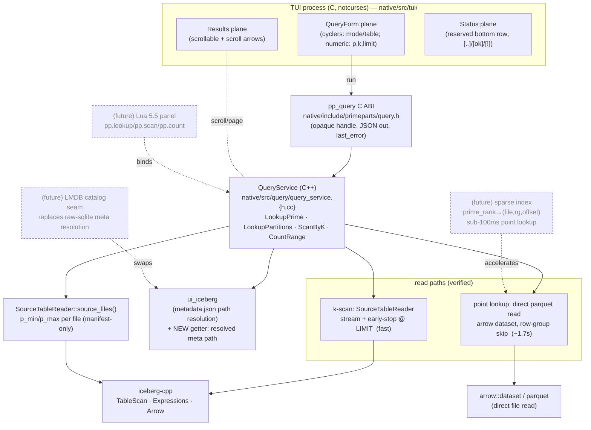
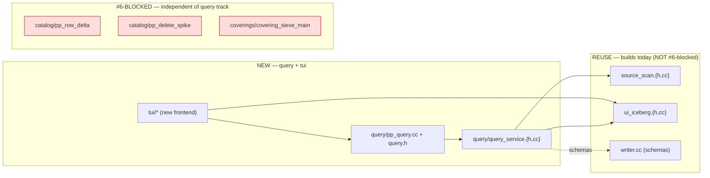

# TUI Data-Query Layer — Design (UML)

**Status:** Phase 0 design, 2026-06-14. Reflects a verified de-risk
(`native/src/query/query_smoke.cc`, `make build/query-smoke`) against the live
`ib-staging/primeparts/primes` table (21.7 B rows). See agent memory
`project_query_latency_envelope` for the measured numbers.

This document is the architectural map for pivoting the native notcurses TUI from
an ops shell into an interactive **data-query** surface. It covers the component
structure, the two read paths, the query sequences, and the module dependency
map. Build plan lives in the session plan file; this is the "what talks to what".

---

## 1. Goal & scope

Two queries, priority-ordered by the user:

1. **k-scan with LIMIT** (wanted now): "show up to N primes where `k == K`",
   optionally within a `[p_lo, p_hi]` window. Near-instant.
2. **Point lookup by p**: "given prime `p`, show its `k` and its
   `(m_k, n_k, q_k)` tuples characterizing its partitions." ~1.7 s on the current layout.
3. **Range count** (free add-on): total + k=0 count in `[p_lo, p_hi]`.

Non-goals (now): joins beyond p-keyed cross-table reads, mutation, the Lua
scripting panel (future), the sparse point-lookup index (future).

---

## 2. Component diagram



**Why a C++ service + thin C ABI:** the TUI is C (notcurses), the readers are
C++ — the same boundary `ui_iceberg` already uses. A clean `QueryService` object
is also the natural Lua binding surface later.

**Why two read paths (verified, not premature):** iceberg-cpp prunes at the
file/manifest level but does **not** skip row-groups within a file. k-scan doesn't
care (early-stop dominates). Point lookup does: going through `SourceTableReader`
reads the whole ~960M-row file (~6s); reading the selected parquet file directly
with arrow's dataset filter skips to the 240M-row row group (~1.7s). File
selection for the direct path comes cheaply from `source_files()` p_min/p_max.

---

## 3. Sequence — point lookup by p

```mermaid
sequenceDiagram
  participant T as TUI
  participant A as pp_query ABI
  participant Q as QueryService
  participant U as ui_iceberg
  participant S as source_files()
  participant P as arrow parquet

  T->>A: pp_query_lookup(h, p)
  A->>Q: LookupPrime(p)
  Q->>U: resolved metadata.json path (primes)
  Q->>S: source_files()  (manifest-only; path+p_min+p_max)
  Q->>Q: pick file where p_min ≤ p ≤ p_max
  Q->>P: dataset(file).filter(p==P).select(p,k,prime_rank)
  P-->>Q: row {p,k,prime_rank}  (~1.7s; row-group skip)
  Q->>Q: LookupPartitions(p): same on partitions table → up to k rows
  Q-->>A: JSON {found,k,prime_rank,partitions:[{m,n,q}...]}
  A-->>T: json_out
```

Note: partitions table is also p-keyed, so the same file-select + direct-read
applies; a prime with `k` partitions yields `k` rows.

---

## 4. Sequence — k-scan with LIMIT (the fast, priority-1 query)

```mermaid
sequenceDiagram
  participant T as TUI
  participant A as pp_query ABI
  participant Q as QueryService
  participant R as SourceTableReader
  participant I as iceberg-cpp

  T->>A: pp_query_scan_k(h, k=K, limit=N)
  A->>Q: ScanByK(K, N)
  Q->>R: OpenMetadata(primes_meta, {p,k,prime_rank}, filter = (k==K))
  R->>I: TableScan.Filter(k==K).PlanFiles()  (k unsorted → no file prune)
  loop until N matches or EOF
    Q->>R: Next(batch)
    Q->>Q: collect rows; break when N reached  (early-stop)
  end
  Q-->>A: JSON {rows:[{p,prime_rank}...]}  (near-instant for common K)
  A-->>T: json_out
```

For common `K` (0,1,2,3 = the bulk) the first batch already yields N matches, so
this returns in milliseconds despite no file-level pruning on `k`.

---

## 5. Module dependency map



**Build decoupling (verified):** the query smoke linked against the installed
static iceberg libs without touching `pp_row_delta` / `covering_sieve` /
`pp_delete_spike`. The query + TUI track is independent of the task-#6
SnapshotUpdate ABI migration **and** of the in-progress vendor merge (installed
`/usr/local/lib` `.a` are pre-merge and stable).

### Schemas (from `writer.cc`)
- `primes`: `(1 p:long, 2 k:int, 3 prime_rank:long, 4 p_bucket_version:int,
  5 p_bucket:int)` — verified against live metadata.
- `partitions`: `(1 p:long, 2 m_k:int, 3 n_k:int,
  4 q_k:long, 5 prime_rank:long, 6 p_bucket_version:int, 7 p_bucket:int)`.
- Cross-table invariant: `sum(k) == rows(partitions)`; no partition rows for k=0.

---

## 6. Latency envelope (measured 2026-06-14)

| Query | Path | Latency | Why |
|---|---|---|---|
| k-scan, common K, LIMIT 10 | SourceTableReader + early-stop | ~ms | first batch has matches |
| point lookup by p | direct parquet, row-group skip | ~1.7 s | 240M-row row groups, no page index |
| point lookup by p | SourceTableReader (whole file) | ~6 s | iceberg-cpp doesn't skip row groups |
| range count | SourceTableReader stream of window | scales w/ window | aggregation |

**Upgrade path (future):** a sparse `prime_rank → (file, row_group, offset)`
index (prime_rank = π(p) via primecount; rows are stored in prime_rank order)
turns point lookup into a single-row-group (or single-page) read → sub-100 ms.
This is the Phase-4 derivative-data / MV-as-index track, not the MVP.
```
