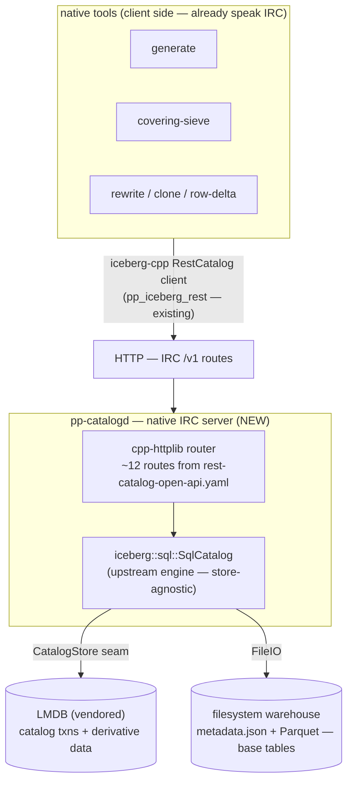
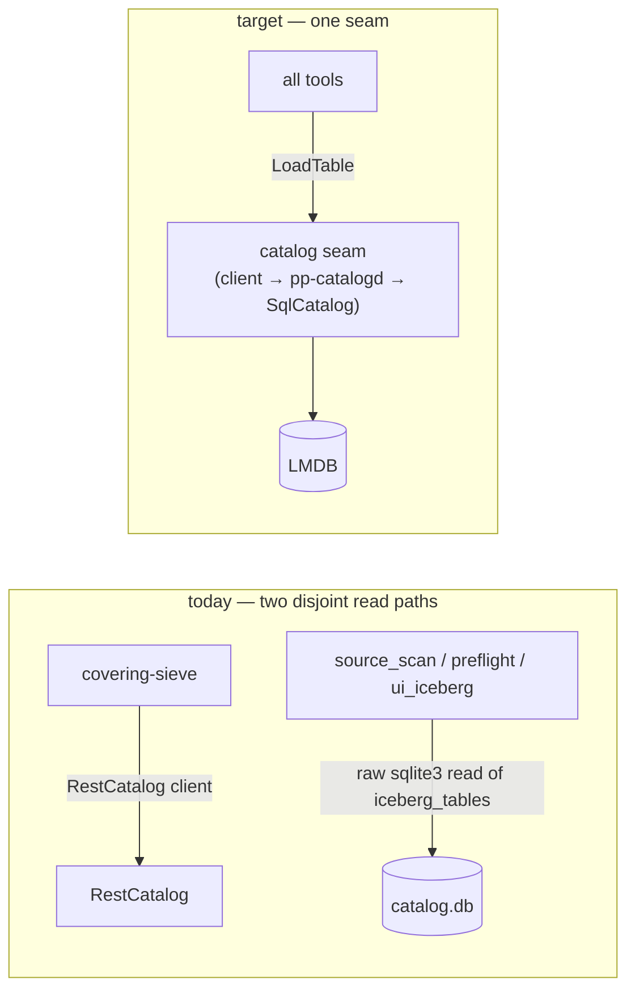

# Native IRC Catalog (LMDB-backed) — Design

**Status:** Phase 0/1 **DONE + VERIFIED** (2026-06-08) — build wiring + LMDB
`CatalogStore` + in-process `SqlCatalog` round-trip both green (`make smoke`).
Phase 2 (`pp-catalogd` IRC server) is next. Living doc; updated as we go.
**Date:** 2026-06-08

## Context

Hive (and its HMS-backed REST servlet at `192.168.1.202:9090`) is being removed
from this branch, along with the MR3/Kubernetes stack and the Python layer. That
servlet was doing double duty: the **catalog of record** and the **query/MV
engine**. The query/MV side moves to native code + igraph. The catalog side is
the gap this design fills.

The earlier catalog of record was a **pyiceberg `SqlCatalog`** (SQLite,
JdbcCatalog schema) at `/media/extssd/research/dioph.pp/data/iceberg/catalog.db`,
mirrored to HMS for the Hive engine. Removing Hive removes the mirror — but the
catalog was Python, which is also gone. We need a **native** local catalog.

**Decision: IRC-forward.** The Iceberg REST Catalog (IRC) contract is the spine.
The existing iceberg-cpp `RestCatalog` *client* integration stays; we add a
native IRC *server* that delegates to upstream `iceberg::sql::SqlCatalog`, backed
by a vendored **LMDB** `CatalogStore`. Tools reach LMDB **only** through the
server. This keeps the documented-standard REST surface (any IRC client —
pyiceberg/Spark/Trino — can also point at it) while the implementation stays
native and in our control.

**LMDB scope:** LMDB holds **only** the IRC catalog transactions (the
`CatalogStore` rows + optimistic-CAS) and **derivative data** (MV-like read
indexes — a separate track). Base Iceberg tables (`primes`, `partitions`,
`primes_k0`, …) stay as Parquet + `metadata.json` on the filesystem, read/written
through iceberg-cpp FileIO. No base data is copied into LMDB.

## Runtime architecture

The metadata engine (apply `TableUpdate`s, write `metadata.json`,
optimistic-concurrency commit) lives in `SqlCatalog`, not in the HTTP layer — so
the server is a thin JSON↔Catalog adapter. nginx/Lua were considered for the edge
and bracketed: there is no Iceberg metadata library outside C++ here, so the
engine must stay in iceberg-cpp; a reverse proxy can front the server later if it
goes remote.

## Components

### Catalog engine — upstream `iceberg::sql::SqlCatalog`

Merged from `origin/main` into the vendored tree (`src/iceberg/catalog/sql/`). It
implements the full `Catalog` API (create/commit/load/register/rename/drop,
namespaces, optimistic CAS) over a driver-agnostic `CatalogStore` interface
(`catalog_store.h`) — "no SQL strings or driver-specific types." Schema is
JdbcCatalog-compatible (`iceberg_tables`, `iceberg_namespace_properties`).

We do **not** use the built-in SQLite/Postgres/MySQL connectors (those need
sqlpp23). Build with `-DICEBERG_BUILD_SQL_CATALOG=ON` and **no** connector:
`resolve_sql_catalog_dependencies()` returns cleanly ("no built-in connectors
enabled"), so the `iceberg_sql_catalog` lib builds from `sql_catalog.cc` +
`connection_uri.cc` with **zero sqlpp23 dependency**. We inject our own store via
`SqlCatalog::Make(config, file_io, store)`.

### LMDB `CatalogStore`

`LmdbCatalogStore : iceberg::sql::CatalogStore`, ~200 lines over vendored
`liblmdb`. The store contract maps 1:1 onto LMDB primitives:

| CatalogStore method | LMDB realization |
|---|---|
| `Initialize()` | mkdir + open env, open two named sub-DBs (`tables`, `nsprops`) |
| `ListNamespaceNames()` | cursor scan **both** DBs, union distinct `ns` (key prefix before `\0`) |
| `GetNamespaceProperties(ns)` | cursor range-scan `nsprops` prefix `ns\0` |
| `InsertNamespaceProperty` | `mdb_put` `MDB_NOOVERWRITE` (`KEYEXIST`→`kAlreadyExists`) |
| `DeleteNamespaceProperty` / `DeleteNamespace` | `mdb_del` / prefix scan + del |
| `ListTableNames(ns)` | cursor range-scan `tables` prefix `ns\0` |
| `TableExists` / `GetTableMetadataLocation` | `mdb_get` on `tables` |
| `InsertTable` | `mdb_put` `MDB_NOOVERWRITE` (`KEYEXIST`→`kAlreadyExists`) |
| `UpdateTableMetadataLocation(expected)` | **CAS**: get → compare to `expected` → put; return 1/0 |
| `DeleteTable` | `mdb_del`, return count |
| `RenameTable` | get `from` → put `to` `MDB_NOOVERWRITE` → del `from` |
| `RunInTransaction(body)` | `mdb_txn_begin` (write) → stash txn → run body → commit/abort |

Sub-DB layout (one env, **two** named DBIs — no separate namespaces DB, matching
the SQL store, which likewise derives namespaces by unioning the properties
table with the distinct table namespaces):
- `nsprops`: key `ns\0propkey` → `<presence-byte><value bytes>` (presence byte
  distinguishes a SQL-NULL property value from an empty string)
- `tables`: key `ns\0name` → `metadata_location\0previous_location`

A namespace **exists** iff it has ≥1 `nsprops` row (`SqlCatalog` inserts a
sentinel `exists="true"` on create) **or** it owns ≥1 table. `SqlCatalog` filters
the sentinel out of `GetNamespaceProperties` itself, so the store returns every
row verbatim.

LMDB's single-writer / multi-reader MVCC fits `RunInTransaction` exactly: the
write txn is stashed in `active_txn_` during `body`, and nested store calls reuse
it (standalone calls open their own short txn, commit on ok / abort on error).
All ops serialize under one `std::recursive_mutex`, so each txn begins+ends on a
single thread inside one critical section — satisfies LMDB's per-thread-txn rule
without `MDB_NOTLS`. One `mdb_env_set_mapsize` (512 MiB default, virtual only).
mmap = low RSS, zero-copy reads.

**Tradeoff:** LMDB drops SQL-DB-level catalog interop (a JdbcCatalog client can't
open an LMDB file). We keep IRC interop (via the server) and standard on-disk
`metadata.json`. Acceptable for purely-local research. The `CatalogStore` seam
keeps SQLite available later (config swap) if interop is ever wanted — no need to
build both now.

### IRC server — `pp-catalogd`

cpp-httplib router (header-only, system `/usr/include/httplib.h`) implementing the
routes the iceberg-cpp `RestCatalog` client exercises (from
`native/vendor/iceberg-refs/rest-catalog-open-api.yaml`): `GET /v1/config`;
namespaces list/load/head/create/drop/properties; tables
list/load/head/create/**commit**/drop/register/rename; metrics (204). Each route
delegates to a process-wide `SqlCatalog(LmdbStore)`.

The substance is server-side JSON: parse `CreateTableRequest`,
`CommitTableRequest` (`requirements` + `updates`), `RegisterTableRequest`;
serialize `LoadTableResult` (`metadata-location` + full `TableMetadata`). Reuse
iceberg-cpp serde where the direction exists; hand-write the inverse with vendored
`nlohmann_json` where it does not. The **commit** handler is mandatory even though
no tool calls `catalog->UpdateTable` directly — `FastAppend`/`RowDelta` commits
route through the IRC `updateTable` endpoint.

> Note: snapshot-advancing native→IRC commits need the distinct `ref`
> requirement field for `assert-ref-snapshot-id`. This is **upstream as of
> iceberg-cpp v0.3.0** — the former local patch is retired (HANDOFF §9 is the
> source of truth).

**Acceptance:** point the unchanged RestCatalog client (`MakeCatalog` with
`rest_uri=http://localhost:PORT`) at `pp-catalogd` and run `PublishTable`
end-to-end (createTable + FastAppend commit + LoadTable).

### Client — unchanged

`pp_iceberg_rest`'s `MakeCatalog` RestCatalog branch and the generic helpers
(`LocalIO`, `EnsureNamespace`, `PublishTable`, `LatestMetadataJson`) work against
any `iceberg::Catalog`. We add a `MakeLocalCatalog` factory that builds
`SqlCatalog(LmdbStore)` for in-process use / the server's engine.

## Write & commit model

The catalog is **single-writer by design.** Exactly one `generate` may write at a
time; this is enforced with a warehouse-level write lock acquired **at startup,
before `pp_init` and before any `pp_process_rank_batch`** (the hot kernel) so a
rejected second writer costs ~nothing. Bucketing (`p_bucket_version` / `p_bucket`)
is an **organizational/metadata axis for reads & analysis**, *not* a
write-parallelism scheme — concurrent or multi-bucket writing is unsupported and
fails fast. Readers are unaffected (LMDB is multi-reader MVCC; parquet and
`metadata.json` are immutable once written).

**Commit ordering — LMDB is last.** A commit writes parquet → manifests →
`metadata.json` to the filesystem **in place first**, then performs the LMDB
`UpdateTableMetadataLocation` CAS **last** (verified in `sql_catalog.cc:405-409`
for create, `:454-466` for commit). Nothing references the new files until that
pointer swap, so the swap *is* the publish. LMDB is the **head ref** (git
analogy): one mutable pointer per table to the current `metadata.json`; the
snapshot history lives in the metadata.json chain, not LMDB. On commit the CAS
checks exactly one thing — "is the head still where I read it" — which under
single-writer always holds; a `CAS→0` therefore signals a bug / lock bypass (hard
error), **not** a race to retry. No CAS-retry loops, no multi-process plumbing.

**Cadence.** Default is **commit-at-end** (a resume run continues from the
committed `primes` frontier, then commits once generation completes). Periodic
checkpoint commits are an optional crash-resilience add-on — each checkpoint is a
snapshot and thus a resume point. `--temp` is the only ephemeral mode: writes
`data/tmp/<run-id>`, starts from p=3/5, never commits, cleans up after.

**Two-table atomicity (the one real subtlety).** `generate` commits both `primes`
and `partitions`; resume reads the `primes` frontier, so a crash *between* the two
commits could resume past a hole. Resolve by the IRC `commitTransaction`
multi-table atomic endpoint (a point in favor of `pp-catalogd`), or — without the
server — by **ordering**: commit `partitions` first, then `primes`, so "primes
present ⇒ partitions present" always holds (a crash leaves only harmless,
re-derivable orphan partitions). Ordered is the recommended no-server fallback.

### Commit-contract interface

The seam shared by `generate`, the sieve, and the server's engine. At the HTTP
boundary it is the IRC contract; in-process it is the `iceberg::Catalog` API.

- **IRC contract (server boundary).** A commit is one verb:
  `POST /v1/{prefix}/namespaces/{ns}/tables/{table}` → `updateTable` with
  `CommitTableRequest { identifier, requirements[], updates[] }`, returning
  `CommitTableResponse { metadata-location, metadata }`. `requirements` are
  assertions validated against the current `TableMetadata` (`assert-create`,
  `assert-table-uuid`, `assert-ref-snapshot-id`, `assert-current-schema-id`,
  `assert-last-assigned-{field,partition}-id`,
  `assert-default-{spec,sort-order}-id`); `updates` are `TableUpdate` actions
  (`add-snapshot`, `set-snapshot-ref`, …). Multi-table atomic commits use
  `POST /v1/{prefix}/transactions/commit`.
- **Engine does the work.** `SqlCatalog` loads current metadata, validates
  requirements, applies updates, writes the new `metadata.json`, and performs the
  store CAS — a layered flow: semantic requirement checks at the metadata layer,
  the narrow head-pointer CAS at the storage layer. The server is a thin
  JSON↔Catalog adapter; tools never touch LMDB directly.
- **In-process realization (DRY endpoint — design intent).** `FastAppend` /
  `RowDelta` already express the `add-snapshot` update; the minimal `Catalog`
  surface the codebase uses is `NamespaceExists`, `CreateNamespace`, `LoadTable`,
  `CreateTable`, `DropTable`, `RegisterTable` + that commit path. Fold the
  duplicated create-or-load + FastAppend + cleanup into one reusable
  `CommitFiles(catalog, table, schema, spec, files)` (a refactor of `PublishTable`,
  `pp_iceberg_rest.cc:139`) fed by a single `{schema, spec}` provider so the
  partition spec the writer uses (`writer.cc:56`) and the one `CreateTable` records
  cannot drift. `generate` should accumulate the in-memory `DataFile`s the writer
  already builds (`writer.cc:362`, `WrittenFile.data_file`) and call this helper —
  retiring the dead `files.jsonl` text bridge.

## Source consolidation (DRY) — woven into the cutover

### Catalog module: remove / keep / refactor

- **Remove:** `pp_hive_sync.{h,cc}` (100% Hive); `pp_catalog_main`'s
  `--smoke-test` / `--hive-exec` / `--hive-sync`; `pp_delete_spike`'s
  `RunDeleteSpike` (beeline-driven).
- **Refactor:** `pp_iceberg_rest` — add `MakeLocalCatalog`, drop Hive comments;
  `RunMorVerify` — swap `HiveExec` create/drop for native `CreateTable`/`DropTable`.
- **Keep:** `pp_row_delta` (pure iceberg-cpp); `pp_sieve_clone` (drop Hive
  fallback messaging).

Minimal `Catalog` surface the codebase uses: `NamespaceExists`,
`CreateNamespace`, `LoadTable`, `CreateTable`, `DropTable`, `RegisterTable`, plus
the commit path (`NewFastAppend` / `RowDelta`).

### The raw-SQLite reader migration (key coupling)

`source_scan.cc`, `preflight.cc`, and `ui_iceberg.cc` each read `iceberg_tables`
**directly via `sqlite3_open`** (identical lookup + `file:` strip + int64 decode,
triplicated) — the current read path for scan/TUI tools, bypassing the catalog
API. Moving the catalog to LMDB strands all three unless they resolve metadata
through the catalog seam. Consolidate the duplicated bits into
`include/primeparts/iceberg_util.h` **and** re-point metadata resolution onto the
catalog (`LoadTable`), not raw SQLite.

### Other DRY hotspots (shared headers)

Arrow thread-pool setup (4 mains), `MakeCatalog`+`RestOptions` boilerplate (2),
progress bar/monitor (2–3), and the `RegisterAll` once-guard (missing in
`rewrite.cc` — latent bug). `source_scan` and `writer` are already clean seams.
Fold `sieve_triage` into `covering_sieve`.

## Phased plan

- **Phase 0 — build wiring. ✅ DONE.** LMDB vendored; `liblmdb.a` built from
  `mdb.c`+`midl.c` (Makefile `$(LMDB_LIB)`). Rebuilt vendored iceberg-cpp
  **static** + `-DICEBERG_BUILD_SQL_CATALOG=ON` (no connector → no sqlpp23) →
  `libiceberg_sql_catalog.a`, linked via `SQL_CATALOG_LDLIBS` (must precede the
  iceberg core archives in static link order). Note: do **not** append
  `-lparquet -larrow` after `ICEBERG_LDLIBS` — the static `.a` are already in it,
  and the trailing `-l` pulls the shared `libarrow.so.2500` (missing) at runtime.
- **Phase 1 — LMDB store (testable without HTTP). ✅ DONE + VERIFIED.**
  `LmdbCatalogStore` (`native/src/catalog/pp_lmdb_store.cc`, factory
  `MakeLmdbCatalogStore`). Smoke binary `primeparts-lmdb-smoke` (`make smoke`),
  two parts, **0 failures**:
  - *Part A — store contract* (no FileIO): unique-violation→`kAlreadyExists`
    (insert table/nsprop, rename-onto-existing); optimistic CAS
    (`UpdateTableMetadataLocation` fresh-base→1, stale-base→0); rename moves
    row+value and frees old key; `RunInTransaction` commit **and** rollback;
    `ListNamespaceNames` unions nsprops-namespaces with table-only namespaces;
    `DeleteNamespace` returns the row count.
  - *Part B — engine integration*: `SqlCatalog::Make(cfg, LocalIO(), lmdb_store)`
    then CreateNamespace → CreateTable (writes `metadata.json`, commits pointer to
    LMDB) → LoadTable → RenameTable → DropTable → DropNamespace, all green. (The
    arrow local FileIO does not mkdir parents — pre-create `<loc>/metadata/`.)
- **Phase 2 — `pp-catalogd`.** cpp-httplib IRC routes over `SqlCatalog(LmdbStore)`;
  server-side JSON shapes; acceptance = RestCatalog client `PublishTable` e2e.
- **Phase 3 — consolidate + de-Hive.** Excise Hive; `iceberg_util.h` + re-point the
  three raw-SQLite readers; hoist shared-header boilerplate; fold `sieve_triage`.
- **Phase 4 — derivative data (separate track).** LMDB-backed derived indexes +
  igraph read paths. Sketch only.

## Build / provisioning facts

- `native/vendor` is **gitignored**; vendored deps are provision-by-clone and keep
  their `.git`. LMDB vendored at `native/vendor/lmdb` (mirror `lmdb/lmdb`,
  `mdb.master3`); sources `libraries/liblmdb/{mdb.c,midl.c,lmdb.h,midl.h}`.
- Installed iceberg libs at `/usr/local/lib` are **static `.a`**; rebuild static to
  match (mixing static/shared/prebuilt → double-free at exit).
- Rebuild recipe baseline: `delete_primitive_spike.md` "Vendored rebuild recipe"
  (static, `BUNDLE=ON`, `REST=ON`); add `-DICEBERG_BUILD_SQL_CATALOG=ON`. Install
  is `sudo cmake --install build-patch` (root-owned `/usr/local/lib`).
- cmake 4.3.3 (≥3.28). `liblmdb.so.0` runtime present; we build from vendored source.

## Risks / open threads

1. **Server JSON shape-matching** (Phase 2) — the real work; prove createTable +
   commit round-trip against the iceberg-cpp client early.
2. **Raw-SQLite reader migration** (Phase 3) — must land with the catalog cutover or
   scan/TUI tools break.
3. **Two-table atomicity** — `generate` commits `primes` + `partitions`; resume
   reads the `primes` frontier. Use `commitTransaction` or commit `partitions`
   before `primes` so a crash never leaves a resumable hole (see Write & commit
   model).
4. **Derivative-data access pattern** — server endpoints vs. shared read env — TBD.

## Verification

- Phase 1: standalone test binary — `SqlCatalog(LmdbStore)` round-trip; inspect
  `catalog.lmdb` with `mdb_stat`/`mdb_dump`.
- Phase 2: run `pp-catalogd`; `curl GET /v1/config`; then the RestCatalog client
  `PublishTable` e2e; confirm `metadata.json` written + `LoadTable` returns it.
- Cross-check: open the same warehouse tables via existing native scan tools.
