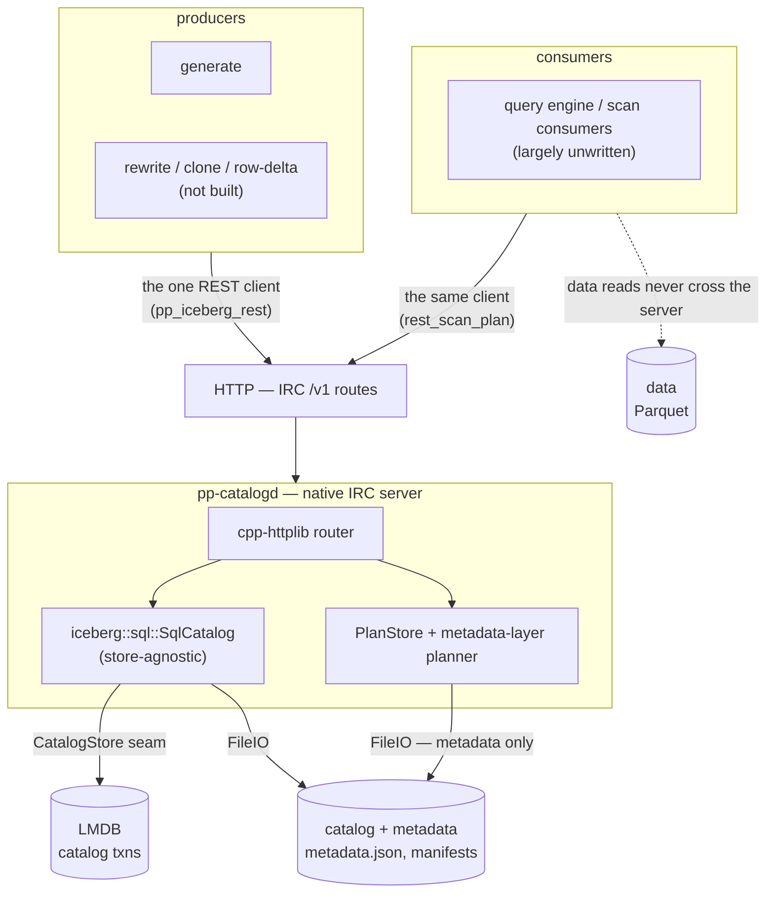

# Native IRC Catalog (LMDB-backed) — Design

The catalog of record is a native Iceberg REST Catalog (IRC): the `pp-catalogd`
server delegates to upstream `iceberg::sql::SqlCatalog`, backed by a vendored
**LMDB** `CatalogStore`. Tools reach LMDB only through the catalog seam
(RestCatalog client → `pp-catalogd` → `SqlCatalog`, or in-process
`SqlCatalog(LmdbStore)`). The REST surface means any IRC client
(pyiceberg/Spark/Trino) can also point at it.

**LMDB scope:** LMDB holds only the IRC catalog transactions (the `CatalogStore`
rows + optimistic CAS). Base Iceberg tables stay as Parquet + `metadata.json` on
the filesystem, read/written through iceberg-cpp FileIO. No base data is copied
into LMDB.

## Runtime architecture

The metadata engine (apply `TableUpdate`s, write `metadata.json`, CAS commit)
lives in `SqlCatalog`; the server is a thin JSON↔Catalog adapter.

The dashed edge is the load-bearing one: the server reads metadata and
manifests, never Parquet. Data reads go consumer→storage directly, so the data
may live on a different machine from the catalog and metadata.

## Components

### Catalog engine — `iceberg::sql::SqlCatalog`

Vendored (`src/iceberg/catalog/sql/`). Implements the full `Catalog` API over a
driver-agnostic `CatalogStore` interface (`catalog_store.h`); schema is
JdbcCatalog-compatible (`iceberg_tables`, `iceberg_namespace_properties`). Built
with `-DICEBERG_BUILD_SQL_CATALOG=ON` and **no** built-in connector (zero sqlpp23
dependency); the store is injected via `SqlCatalog::Make(config, file_io, store)`.

### LMDB `CatalogStore`

`LmdbCatalogStore : iceberg::sql::CatalogStore` over vendored `liblmdb`. The store
contract maps 1:1 onto LMDB primitives:

| CatalogStore method | LMDB realization |
|---|---|
| `Initialize()` | mkdir + open env, open two named sub-DBs (`tables`, `nsprops`) |
| `ListNamespaceNames()` | cursor scan both DBs, union distinct `ns` |
| `GetNamespaceProperties(ns)` | cursor range-scan `nsprops` prefix `ns\0` |
| `InsertNamespaceProperty` | `mdb_put` `MDB_NOOVERWRITE` (`KEYEXIST`→`kAlreadyExists`) |
| `DeleteNamespaceProperty` / `DeleteNamespace` | `mdb_del` / prefix scan + del |
| `ListTableNames(ns)` | cursor range-scan `tables` prefix `ns\0` |
| `TableExists` / `GetTableMetadataLocation` | `mdb_get` on `tables` |
| `InsertTable` | `mdb_put` `MDB_NOOVERWRITE` (`KEYEXIST`→`kAlreadyExists`) |
| `UpdateTableMetadataLocation(expected)` | CAS: get → compare `expected` → put; return 1/0 |
| `DeleteTable` | `mdb_del`, return count |
| `RenameTable` | get `from` → put `to` `MDB_NOOVERWRITE` → del `from` |
| `RunInTransaction(body)` | `mdb_txn_begin` (write) → stash txn → run body → commit/abort |

Sub-DB layout (one env, two named DBIs, matching the SQL store which derives
namespaces by unioning the properties table with the distinct table namespaces):

- `nsprops`: key `ns\0propkey` → `<presence-byte><value>` (presence byte
  distinguishes SQL-NULL from empty string)
- `tables`: key `ns\0name` → `metadata_location\0previous_location`

A namespace exists iff it has ≥1 `nsprops` row (`SqlCatalog` inserts a sentinel
`exists="true"` on create, and filters it out of `GetNamespaceProperties` itself)
or owns ≥1 table.

LMDB's single-writer / multi-reader MVCC fits `RunInTransaction`: the write txn is
stashed in `active_txn_` during `body`, and nested store calls reuse it
(standalone calls open their own short txn). All ops serialize under one
`std::recursive_mutex`, so each txn begins+ends on one thread inside one critical
section — satisfies LMDB's per-thread-txn rule without `MDB_NOTLS`. `mmap` = low
RSS, zero-copy reads.

A JdbcCatalog client cannot open an LMDB file; IRC interop (via the server) and
standard on-disk `metadata.json` are kept. The `CatalogStore` seam leaves SQLite
available by config swap if DB-level interop is ever wanted.

### IRC server — `pp-catalogd`

`native/src/catalog/pp_catalogd.{h,cc}` + `pp_catalogd_main.cc` →
`primeparts-catalogd`. A cpp-httplib router over a process-wide
`SqlCatalog(LmdbStore)` (`MakeLocalCatalogWithStore`). Route status:
`catalogd_rest_gap.md`.

Flags: `--warehouse`, `--host`, `--port`, plus the planning knobs
`--scan-planning-mode server|client`, `--plan-batch N` and `--plan-ttl N`.

Server-side JSON reuses iceberg-cpp's exported internal serde
(`json_serde_internal.h`) for both directions (`CreateTableRequest`,
`CommitTableRequest` {`requirements`+`updates`}, `RegisterTableRequest`,
`LoadTableResult`, `TableMetadata`) — no hand-written serializers. Compiled with
`-Ivendor/iceberg-cpp/src` for the internal headers only; `nlohmann_json` matches
the archives' ABI (3.11.3, pinned by configure). Deletion-vector forward-
compatible: DV/Puffin specifics ride inside `add-snapshot` updates, no server
change (that work is writer-side).

### Scan planning

catalogd serves the spec's four planning routes and advertises
`scan-planning-mode: server`. Two properties define the split of labor:

- **The server plans to the metadata layer only.** It walks manifests and prunes
  on `DataFile` statistics; it never opens a parquet file. Row-group selection
  (`scan::RefineSplits`) is the data layer and stays with whoever reads the data.
- **Held state, not a synchronous answer.** `PlanStore` keys plans by opaque
  plan-id; `planTableScan` returns `submitted` and the client polls
  `fetchPlanningResult`, paging any overflow through `fetchScanTasks`.

The practical consequence is topological: catalogd needs no FileIO reach to
wherever the parquet lives, so catalog and metadata may sit on one machine and
the data on another. Detail: `catalogd_rest_gap.md`.

### Client

`pp_iceberg_rest`'s `MakeCatalog` RestCatalog branch and the generic helpers
(`LocalIO`, `EnsureNamespace`, `EnsureTable`, `PublishTable`, `LatestMetadataJson`)
work against any `iceberg::Catalog`. `MakeLocalCatalogWithStore` builds
`SqlCatalog(LmdbStore)` and surfaces both the catalog and the store handle (the
store is needed for `RunInTransaction`).

Vendored `RestCatalog` has the four planning `Endpoint::` constants but no
methods for them, so `rest_scan_plan.{h,cc}` supplies the calls —
`SubmitTableScan`, `FetchPlanningResult`, `CancelPlanning`, `FetchScanTasks` —
plus `PlanScanOnServer`, which drives the whole lifecycle. It takes our own
`scan::ScanPlanRequest` and returns `iceberg::FileScanTask`, so a consumer
builds one request whether planning runs on the server or in-process, and no
vendored-internal type appears in our headers.

## Write & commit model

**Single-writer by design.** Exactly one `generate` may write at a time, enforced
with a warehouse-level write lock acquired at startup before `pp_init`. Bucketing
(`p_bucket_version` / `p_bucket`) is an organizational axis for reads/analysis,
not a write-parallelism scheme. Readers are unaffected (LMDB multi-reader MVCC;
parquet and `metadata.json` immutable once written).

**LMDB is last.** A commit writes parquet → manifests → `metadata.json` to the
filesystem first, then performs the `UpdateTableMetadataLocation` CAS last.
Nothing references the new files until that pointer swap, so the swap is the
publish. LMDB is the head ref (git analogy): one mutable pointer per table to the
current `metadata.json`; snapshot history lives in the metadata.json chain. Under
single-writer the CAS always holds; a `CAS→0` signals a bug / lock bypass (hard
error), not a race to retry.

**Cadence.** Default is commit-at-end (a resume run continues from the committed
`primes` frontier, then commits once generation completes). `--temp` writes to a
scratch warehouse, never commits, cleans up.

**Two-table atomicity.** `generate` commits `primes` and `partitions` in one
`commitTransaction`: `CommitFilesAtomic` stages both tables' parquet, moves files
in, builds one `{table-changes:[...]}` body, and commits through a single
transport — a daemon POST to `/v1/transactions/commit`, or an in-process
`store->RunInTransaction`. Either way both head pointers swap in one LMDB write txn
or neither does.

### Commit-contract interface

The seam shared by the producers and the server's engine. At the HTTP boundary
it is the IRC contract; in-process it is the `iceberg::Catalog` API.

- **IRC contract.** Single-table commit is `POST .../tables/{table}` →
  `updateTable` with `CommitTableRequest { identifier, requirements[], updates[] }`.
  `requirements` are assertions against current `TableMetadata` (`assert-create`,
  `assert-table-uuid`, `assert-ref-snapshot-id`, `assert-current-schema-id`,
  `assert-last-assigned-{field,partition}-id`, `assert-default-{spec,sort-order}-id`);
  `updates` are `TableUpdate` actions (`add-snapshot`, `set-snapshot-ref`, …).
  Multi-table atomic commits use `POST /v1/transactions/commit`.
- **Engine does the work.** `SqlCatalog` loads current metadata, validates
  requirements, applies updates, writes the new `metadata.json`, and performs the
  store CAS — semantic checks at the metadata layer, the narrow head-pointer CAS at
  the storage layer.
- **Client assembly.** The client owns all file data: `NewFastAppend` →
  `AppendFile` → `SnapshotUpdate::Apply()` (writes manifests + manifest list,
  returns the snapshot without committing) → `AddSnapshot` + `SetSnapshotRef` +
  `TableRequirements::ForUpdateTable`, serialized via the internal serde.
  `CommitFiles` (single table) and `CommitFilesAtomic` (multi-table) are the two
  entry points; both move staged parquet into the table tree before the append so
  manifests only ever record committed paths.

## Build / provisioning

Canonical build doc is `BUILD.md`. Provisioning is `native/configure` + git
submodules under `native/vendor/`, built rootless into `$HOME/.local`:

- Submodules: `lmdb` (`liblmdb.a` from `libraries/liblmdb/{mdb.c,midl.c}`),
  `iceberg-cpp` (pinned `v0.3.0`, built `BUNDLE=ON REST=ON SQL_CATALOG=ON`,
  static), `arrow` (static).
- Header-only deps fetched into `$PREFIX/include` by configure:
  `nlohmann/json.hpp` + `json_fwd.hpp`, `httplib.h`.
- All-static Arrow/iceberg cluster; `-liceberg_sql_catalog` links before the
  iceberg core archives (static link order). Do not append `-lparquet -larrow`
  after `ICEBERG_LDLIBS` — the static `.a` are already in it, and a trailing `-l`
  pulls the shared `libarrow.so` at runtime.

## Verification

`make smoke`: `primeparts-lmdb-smoke` (store contract + `SqlCatalog` round-trip),
`primeparts-catalogd-smoke` (server + RestCatalog client createTable → FastAppend
commit → reload-scan → dropTable), `primeparts-commit-smoke` (two-table atomic
commit + rollback on a tampered requirement), `primeparts-generate-smoke`
(`generate` commit + resume through the daemon).

`make test` is the unit suite (`primeparts-tests`), including `PlanStoreTest`
for the plan-id lifecycle and `ScanPlannerTest` for the metadata/data boundary.
`make e2e` forks a real catalogd on :18181 and drives it, covering the full
planning lifecycle, plan-task paging, the advertised planning mode, and the
agreement between server-side and in-process planning.

Four tests are **deliberately red**, each pinning an open hole rather than a
regression; they are inventoried in `../plans/holes_registry.md`. Do not "fix"
them without closing the hole behind them.
